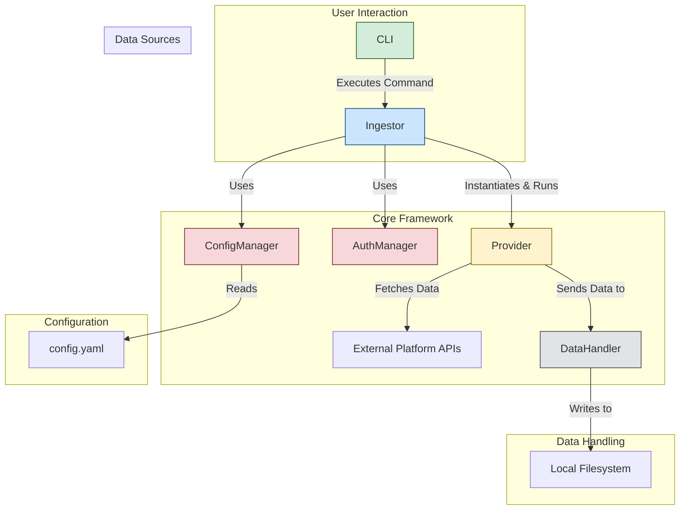

# Architecture Design: Data Ingestor
<!-- LOCKED:DIA:2023-05-28T14:48:00Z:2023-05-28T14:53:00Z -->
<!-- Updated: 2023-05-28T14:48:00Z -->

This document outlines the high-level architecture for the Data Ingestor project.

## Core Principles

- **Modularity**: Each component has a single responsibility and can be developed and tested in isolation.
- **Extensibility**: Adding a new data source (Provider) should require minimal changes to the core framework.
- **TOS Compliance**: The framework will provide hooks and properties to ensure provider implementations can respect rate limits and other platform rules.

## System Components

The system is composed of several key components that work together to download, process, and store user data.

### 1. `Ingestor` (Orchestrator)
- **Responsibility**: The main entry point that orchestrates the entire data ingestion process.
- **Functionality**:
    - Initializes `ConfigManager` and `AuthManager`.
    - Discovers and instantiates the requested `Provider` modules.
    - Executes the provider's data fetching logic.
    - Logs progress and status using a logging utility (e.g., `rich`).

### 2. `ConfigManager`
- **Responsibility**: Manages all configuration for the application.
- **Functionality**:
    - Loads settings from a `config.yaml` file.
    - Validates configuration schema.
    - Provides a simple interface to access configuration properties (e.g., `config.get('download_path')`).

### 3. `AuthManager`
- **Responsibility**: Handles secure storage and retrieval of authentication credentials.
- **Functionality**:
    - Manages API keys, tokens, and other secrets.
    - Provides methods for providers to retrieve necessary credentials.
    - May interact with system keychains or `.env` files for secure storage.

### 4. `BaseProvider` (Abstract Base Class)
- **Responsibility**: Defines the standard interface for all data source providers.
- **Functionality**:
    - Defines abstract methods like `authenticate()`, `fetch_data()`, `get_status()`.
    - Contains common helper methods and properties (e.g., `rate_limit`, `user_agent`).
    - Ensures all providers have a consistent structure, making them interchangeable.

### 5. `DataHandler`
- **Responsibility**: Manages the processing and storage of downloaded data.
- **Functionality**:
    - Receives raw data from providers.
    - Formats data into a standardized structure (e.g., JSON).
    - Writes data to the local filesystem in an organized directory structure (e.g., `output/<provider_name>/<timestamp>/`).

### 6. Command-Line Interface (`CLI`)
- **Responsibility**: Provides the user interface for running the application.
- **Functionality**:
    - Built using a library like `click` or `argparse`.
    - Allows users to specify which provider to run, override config settings, etc.
    - Displays progress and results to the user. 