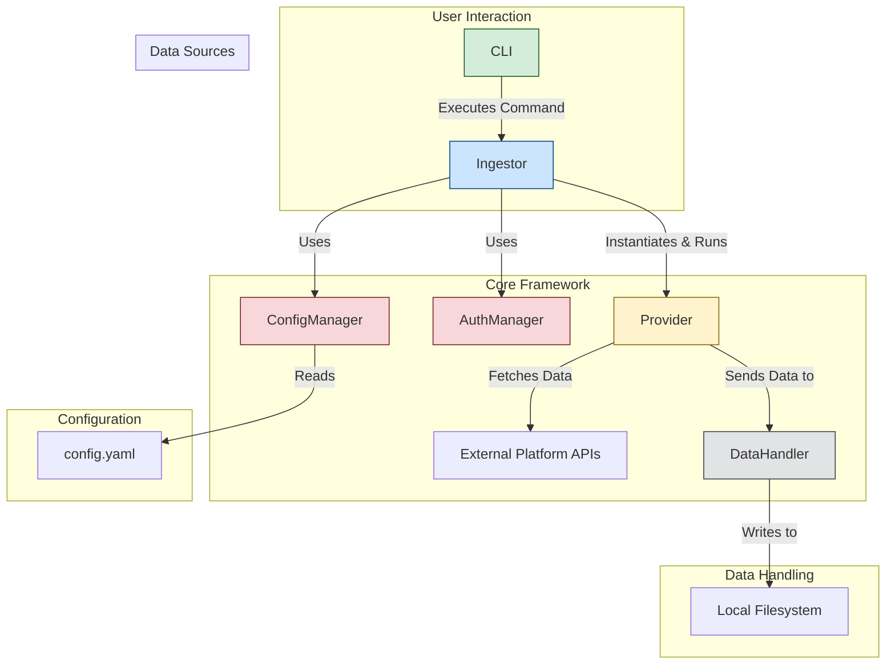

# Architecture Design: Data Ingestor
<!-- Updated: 2023-05-28T14:48:00Z -->

This document outlines the high-level architecture for the Data Ingestor project.

## Core Principles

- **Modularity**: Each component has a single responsibility and can be developed and tested in isolation.
- **Extensibility**: Adding a new data source (Provider) should require minimal changes to the core framework.
- **TOS Compliance**: The framework will provide hooks and properties to ensure provider implementations can respect rate limits and other platform rules.

## System Components

The system is composed of several key components that work together to download, process, and store user data.

### 1. `Ingestor` (Orchestrator)
- **Responsibility**: The main entry point that orchestrates the entire data ingestion process.
- **Functionality**:
    - Initializes `ConfigManager` and `AuthManager`.
    - Discovers and instantiates the requested `Provider` modules.
    - Executes the provider's data fetching logic.
    - Logs progress and status using a logging utility (e.g., `rich`).

### 2. `ConfigManager`
- **Responsibility**: Manages all configuration for the application.
- **Functionality**:
    - Loads settings from a `config.yaml` file.
    - Validates configuration schema.
    - Provides a simple interface to access configuration properties (e.g., `config.get('download_path')`).

### 3. `AuthManager`
- **Responsibility**: Handles secure storage and retrieval of authentication credentials.
- **Functionality**:
    - Manages API keys, tokens, and other secrets.
    - Provides methods for providers to retrieve necessary credentials.
    - May interact with system keychains or `.env` files for secure storage.

### 4. `BaseProvider` (Abstract Base Class)
- **Responsibility**: Defines the standard interface for all data source providers.
- **Functionality**:
    - Defines abstract methods like `authenticate()`, `fetch_data()`, `get_status()`.
    - Contains common helper methods and properties (e.g., `rate_limit`, `user_agent`).
    - Ensures all providers have a consistent structure, making them interchangeable.

### 5. `DataHandler`
- **Responsibility**: Manages the processing and storage of downloaded data.
- **Functionality**:
    - Receives raw data from providers.
    - Formats data into a standardized structure (e.g., JSON).
    - Writes data to the local filesystem in an organized directory structure (e.g., `output/<provider_name>/<timestamp>/`).

### 6. Command-Line Interface (`CLI`)
- **Responsibility**: Provides the user interface for running the application.
- **Functionality**:
    - Built using a library like `click` or `argparse`.
    - Allows users to specify which provider to run, override config settings, etc.
    - Displays progress and results to the user.

## Authentication and Authorization

Authentication will be managed by the `AuthManager`, which will primarily use environment variables (`.env` file) to store API keys and secrets. 

For providers requiring OAuth 2.0 (like Google), the respective provider module will be responsible for handling the authorization flow (redirecting the user, handling callbacks, and storing tokens).

## Google Data Portability API

Initial research indicates that a direct, automated Google Takeout export is not supported. The correct, TOS-compliant method for programmatically accessing user data is the **Google Data Portability API**.

### Key Characteristics:
- **OAuth 2.0**: Access requires user consent via a standard OAuth 2.0 flow. The application must be registered with Google Cloud, and an OAuth consent screen must be configured.
- **Granular Scopes**: The API uses specific scopes to request access to different data types (e.g., `myactivity.youtube`, `myactivity.search`). This gives users fine-grained control over what they share.
- **Verification Required**: Many scopes are classified as "sensitive" or "restricted." To use these in a production application, the app must undergo a verification process by Google to ensure it complies with their data handling policies.
- **No Direct Takeout**: This API does not trigger a traditional Takeout `.zip` file export. Instead, it provides direct API access to the underlying data, which this application will then need to process and save.

The implementation of the `GoogleProvider` will need to handle the entire OAuth 2.0 lifecycle.

## Data Flow

The orchestrator that discovers and executes available providers.
*   **CLI**:
    A command-line interface for listing and running providers. 